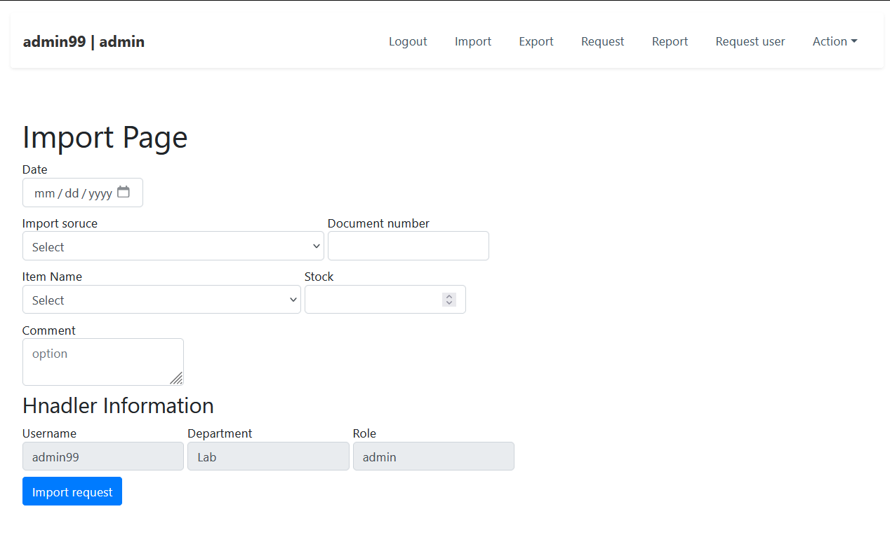
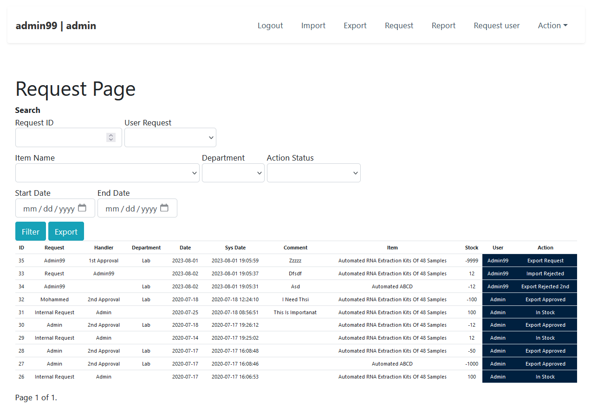
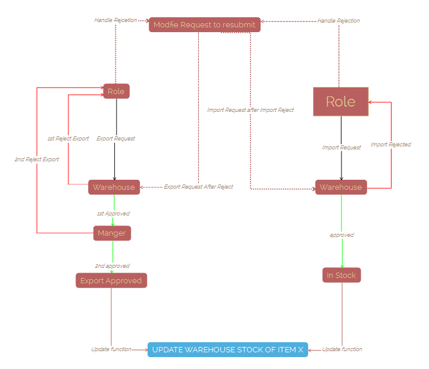

# Inventory-Management
An inventory management system application designed to efficiently track, organize, and control inventory of items and materials throughout their entire lifecycle. It plays a crucial role in optimizing inventory levels, reducing operational costs, and ensuring smooth supply chain operations.

### Python django
before start check document under Docs

### New Import Request 

### Requests Status 

### All Requests

### Request Flow

